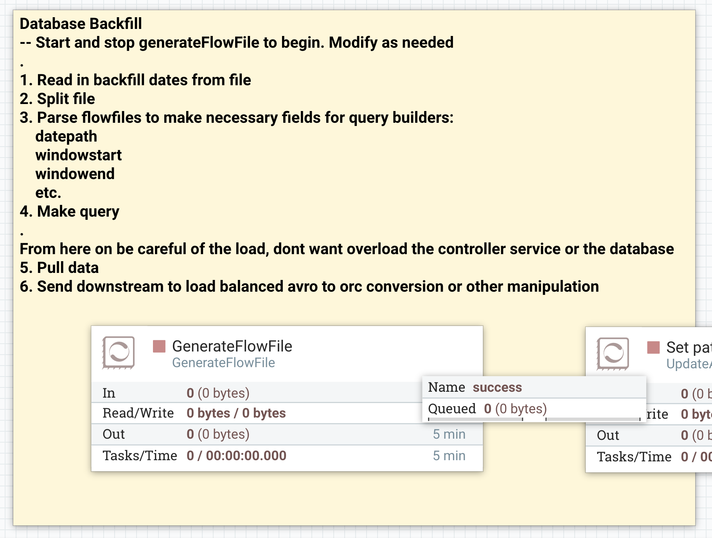
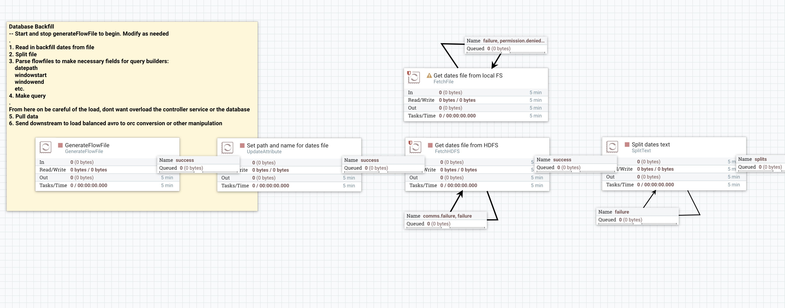
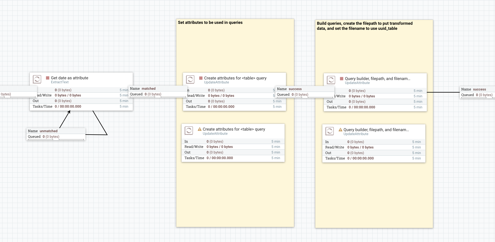
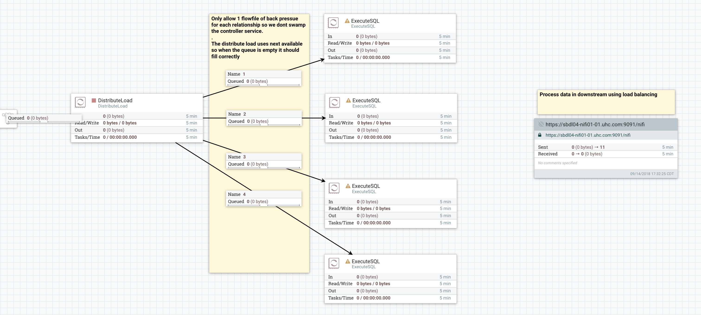

# Database Backfill
This is a template that can be set up to pull large amounts of data from database tables that contain time-stamped data. I made it because I needed to pull months (6+) of historical data into HDFS.

The template contains some instructions for setting up in addition to what is here.

## How to use
1. Edit the backfill-dates.txt file for any days that need to be pulled.

2. Put the backfill-dates.txt file either on HDFS or in the local file system so it can be read by NiFi.

3. Import the template to NiFi

4. The processors have default property values so go through them and configure them to work for your use case.

5. Connect to a larger flow or start and stop the GenerateFlowFile processor.

## Images

