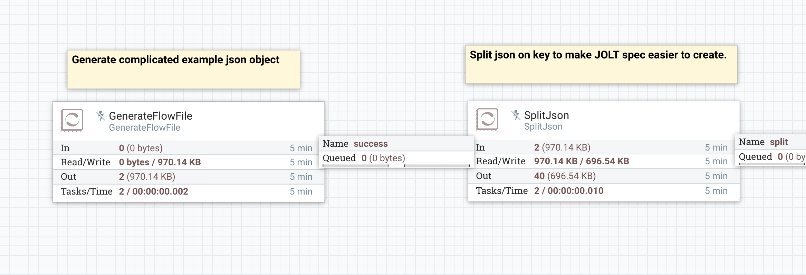
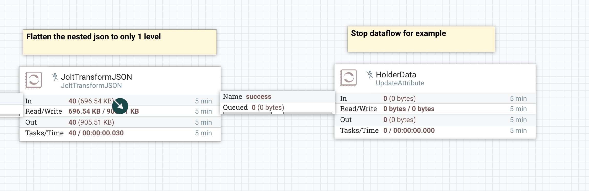

# Flatten Complex JSON Using JOLT

Here is an example of how I used [JOLT](https://jolt-demo.appspot.com/#inception) to flatten a complicated JSON object that I got back when querying an api.

JOLT spec I used can be seen in the [jolt-spec.json](./jolt-spec.json) file.

## Steps

1. Start the `GenerateFlowFile` processor to create a flowfile that contains an example of a complex JSON object. (Section 1)

2. Split a list of elements within the JSON to make creating the JOLT spec easier. (Section 1)

3. Flatten flatten the JSON in the flowfiles split from the original. See a sample [example](./partial-flattened-example.json) of how the flattened JSON looks after the JOLT transform. (Section 2)

## Images

Section 1

Section 2

